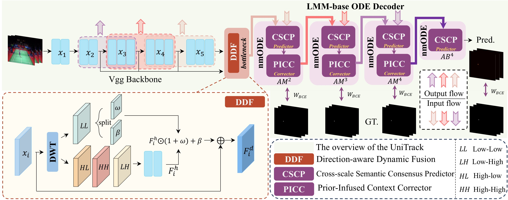
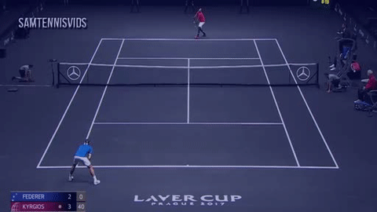
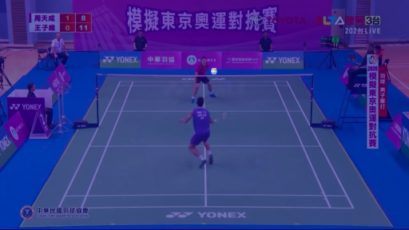
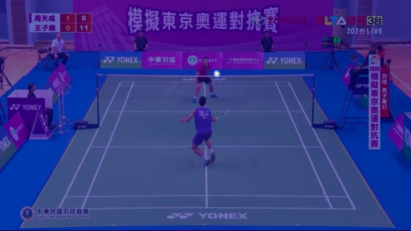

<h1 align="center">
  UniTrack: A Unified Framework for Lightweight and <br/> Robust
  Fast-Moving Tiny Ball Tracking
</h1>


<p align="center">
  
</p>


<p align="center">
  <b>📄 Supplementary Material:</b>
  <a href="assets/Supplementary/Supplementary Material.pdf"><b>Download PDF</b></a>
</p>


<h2>UniTrack Framework</h2>
  <p align="center">
    
  </p>


<h2>Visualization</h2>
<div align="center">
  
  
  
  
</div>
<div align="center">
  
  
  
  
</div>
<div align="center">
  
  
  
  
</div>
<div align="center">
  
  
  
  
</div>
<div align="center">
  
  
  
  
</div>


<h2>Heatmap Overlays</h2>
<div align="center">
  
  
  
  
</div>
<div align="center">
  
  
  
  
</div>
<div align="center">
  
  
  
  
</div>
<div align="center">
  
  
  
  
</div>


## 📌 Overview
This project provides Python scripts for visualization demos, including:

- ✅ runnable/testable code
- ✅ pretrained weights
- ❗ Note: training and the complete inference pipeline are not released during the anonymous submission stage. The demo code provided here is for reference only and may differ from the implementation in the paper; the full official code will be released after the paper is accepted.


## 🚀 Quick Start
```bash
python demo.py \
  --tracknet_file models/TrackNetBeta.pt \
  --dataset tennis_game_level_split \
  --save_dir ./prediction \
  --learning_rate 1.0 \
  --device cuda:0 \
  --tolerance 4
```

## 🛠️ Dependencies
Please install following essential dependencies (see requirements.txt):
```bash
pip install -r requirements.txt
```


